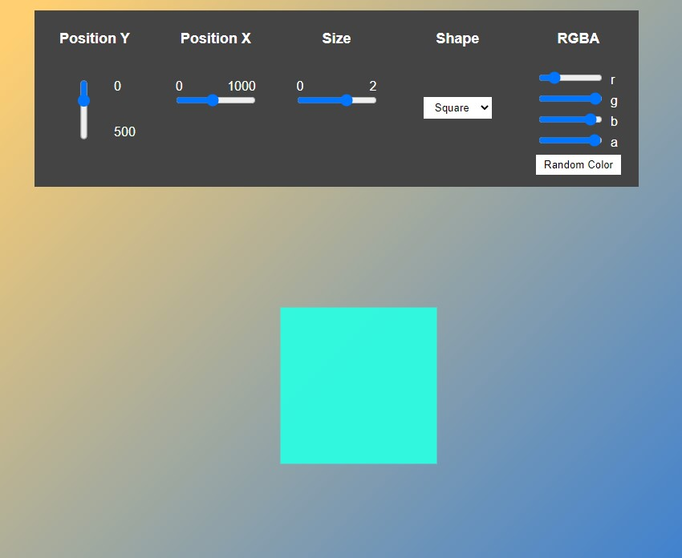

# CSS Property Changer

[This project](https://gurhanalan.github.io/JS-SmallProject-CSSPropertyChanger/) is a small app which the user can change the position, color, shape and size of a box by click the control buttons.

## Table of contents

- [CSS Property Changer](#css-property-changer)
  - [Table of contents](#table-of-contents)
  - [Overview](#overview)
    - [The challenge](#the-challenge)
    - [Screenshot](#screenshot)
    - [Links](#links)
  - [My process](#my-process)
    - [Built with](#built-with)

## Overview

### The challenge

Users should be able to:

-   View the optimal layout for the app depending on their device's screen size
-   See hover states for all interactive elements on the page
-   Change the position, color, shape and size of a box by click the control buttons.

### Screenshot

### Links

-   Solution URL: [Live Website](https://gurhanalan.github.io/JS-SmallProject-CSSPropertyChanger/)

## My process

### Built with

-   Semantic HTML5 markup
-   CSS custom properties
-   CSS Flexbox
-   Desktop-first workflow
-   Javascript
